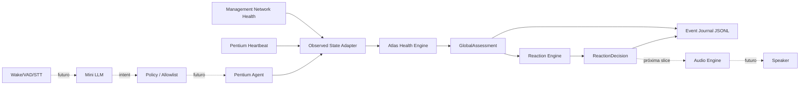
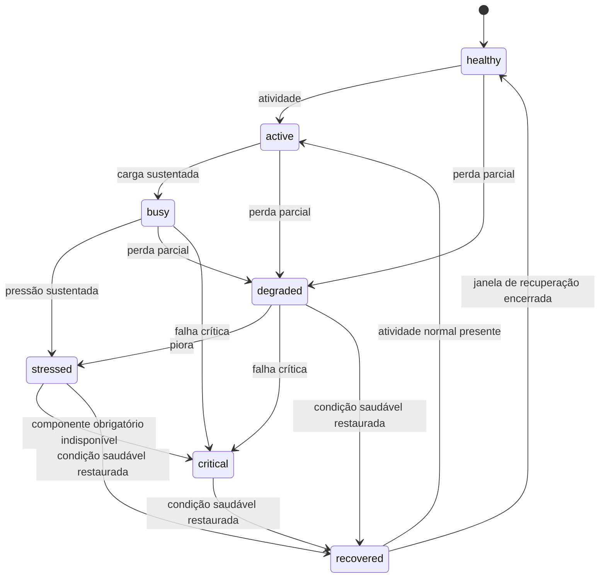
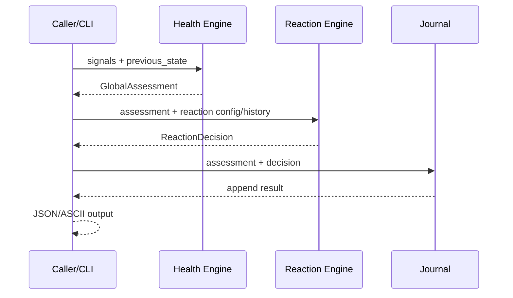
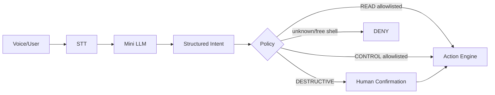

# UML — Atlas State & Reaction Foundation

## Componentes

```mermaid
flowchart LR
    NET[Management Network Health] --> ADAPTER[Observed State Adapter]
    HB[Pentium Heartbeat] --> ADAPTER
    AGENT[Pentium Agent] --> ADAPTER

    ADAPTER --> HEALTH[Atlas Health Engine]
    HEALTH --> ASSESS[GlobalAssessment]
    ASSESS --> REACTION[Reaction Engine]
    ASSESS --> JOURNAL[Event Journal JSONL]

    REACTION --> DECISION[ReactionDecision]
    DECISION --> JOURNAL
    DECISION -. próxima slice .-> AUDIO[Audio Engine]

    AUDIO -. futuro .-> SPEAKER[Speaker]
    VOICE[Wake/VAD/STT] -. futuro .-> LLM[Mini LLM]
    LLM -. intent .-> POLICY[Policy / Allowlist]
    POLICY -. futuro .-> AGENT
```

## Máquina de estados técnicos

```mermaid
stateDiagram-v2
    [*] --> healthy
    healthy --> active: atividade
    active --> busy: carga sustentada
    busy --> stressed: pressão sustentada
    healthy --> degraded: perda parcial
    active --> degraded: perda parcial
    busy --> degraded: perda parcial
    degraded --> stressed: piora
    stressed --> critical: componente obrigatório indisponível
    degraded --> critical: falha crítica
    busy --> critical: falha crítica
    critical --> recovered: condição saudável restaurada
    stressed --> recovered: condição saudável restaurada
    degraded --> recovered: condição saudável restaurada
    recovered --> healthy: janela de recuperação encerrada
    recovered --> active: atividade normal presente
```

## Sequência da primeira slice

```mermaid
sequenceDiagram
    participant C as Caller/CLI
    participant H as Health Engine
    participant R as Reaction Engine
    participant J as Journal

    C->>H: signals + previous_state
    H-->>C: GlobalAssessment
    C->>R: assessment + reaction config/history
    R-->>C: ReactionDecision
    C->>J: assessment + decision
    J-->>C: append result
    C-->>C: JSON/ASCII output
```

## Fronteira de segurança futura

```mermaid
flowchart LR
    USER[Voice/User] --> STT[STT]
    STT --> LLM[Mini LLM]
    LLM --> INTENT[Structured Intent]
    INTENT --> POLICY{Policy}
    POLICY -->|READ allowlisted| EXEC[Action Engine]
    POLICY -->|CONTROL allowlisted| EXEC
    POLICY -->|DESTRUCTIVE| CONFIRM[Human Confirmation]
    CONFIRM --> EXEC
    POLICY -->|unknown/free shell| DENY[DENY]
```
