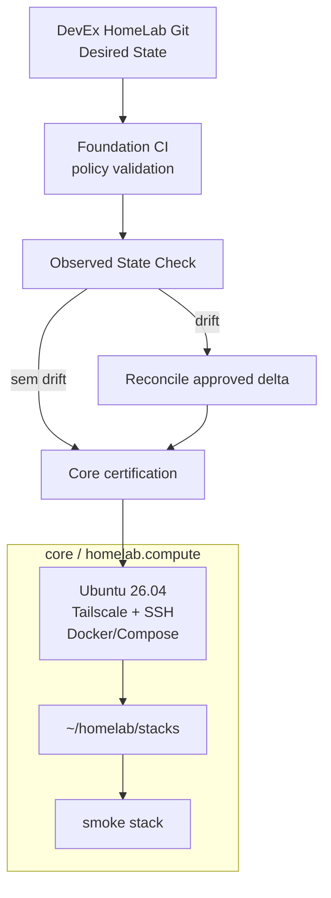
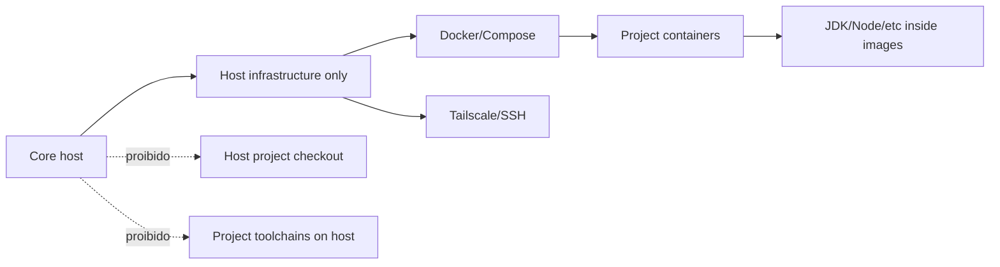

# UML — Core Compute Node

## Deployment

```mermaid
flowchart TB
    Git[DevEx HomeLab Git\nDesired State] --> CI[Foundation CI\npolicy validation]
    CI --> Observe[Observed State Check]
    Observe -->|sem drift| Cert[Core certification]
    Observe -->|drift| Reconcile[Reconcile approved delta]
    Reconcile --> Cert

    subgraph Core[core / homelab.compute]
      Host[Ubuntu 26.04\nTailscale + SSH\nDocker/Compose]
      Stacks[~/homelab/stacks]
      Smoke[smoke stack]
      Host --> Stacks
      Stacks --> Smoke
    end

    Cert --> Host
```

## Ownership

```mermaid
flowchart LR
    CoreHost[Core host] --> Infra[Host infrastructure only]
    Infra --> Docker[Docker/Compose]
    Infra --> Net[Tailscale/SSH]
    Docker --> ProjectContainers[Project containers]
    ProjectContainers --> Toolchains[JDK/Node/etc inside images]
    CoreHost -. proibido .-> ProjectCheckout[Host project checkout]
    CoreHost -. proibido .-> HostToolchains[Project toolchains on host]
```
