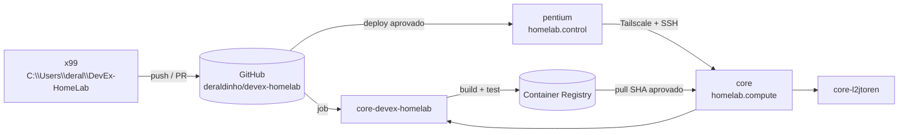
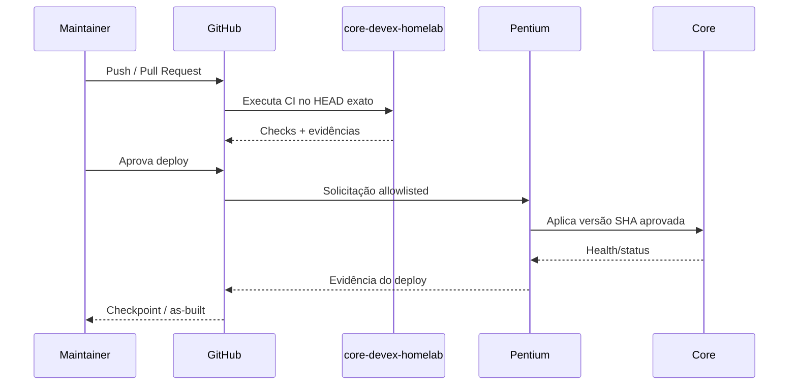
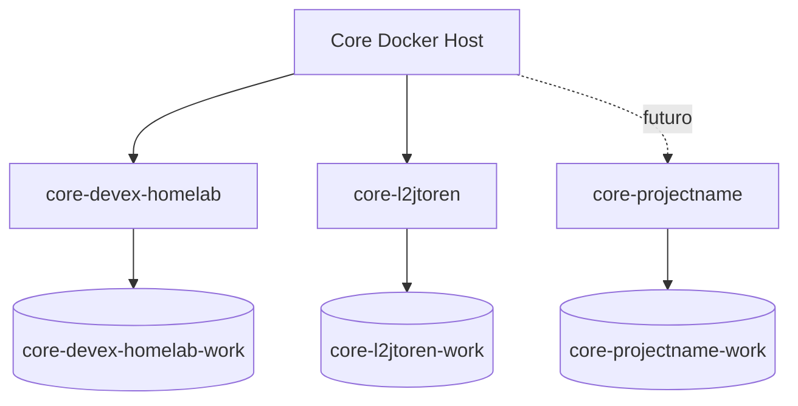

# UML — Deployment e Entrega

## Deployment

```mermaid
flowchart LR
    DEV[x99\nC:\\Users\\deral\\DevEx-HomeLab]
    GH[(GitHub\nderaldinho/devex-homelab)]
    REG[(Container Registry)]
    P[pentium\nhomelab.control]
    C[core\nhomelab.compute]
    RH[core-devex-homelab]
    RL[core-l2jtoren]

    DEV -->|push / PR| GH
    GH -->|job| RH
    RH -->|build + test| REG
    GH -->|deploy aprovado| P
    P -->|Tailscale + SSH| C
    REG -->|pull SHA aprovado| C
    C --> RH
    C --> RL
```

## Sequência de promoção

```mermaid
sequenceDiagram
    participant U as Maintainer
    participant G as GitHub
    participant R as core-devex-homelab
    participant P as Pentium
    participant C as Core

    U->>G: Push / Pull Request
    G->>R: Executa CI no HEAD exato
    R-->>G: Checks + evidências
    U->>G: Aprova deploy
    G->>P: Solicitação allowlisted
    P->>C: Aplica versão SHA aprovada
    C-->>P: Health/status
    P-->>G: Evidência do deploy
    G-->>U: Checkpoint / as-built
```

## Ownership de runners

```mermaid
flowchart TD
    CORE[Core Docker Host]
    DEVEX[core-devex-homelab]
    L2J[core-l2jtoren]
    FUT[core-projectname]
    V1[(core-devex-homelab-work)]
    V2[(core-l2jtoren-work)]
    V3[(core-projectname-work)]

    CORE --> DEVEX --> V1
    CORE --> L2J --> V2
    CORE -. futuro .-> FUT --> V3
```
