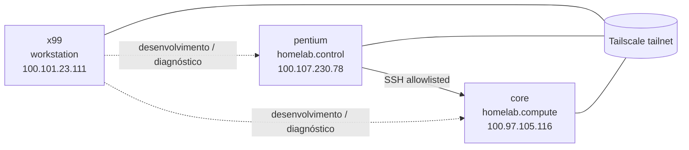
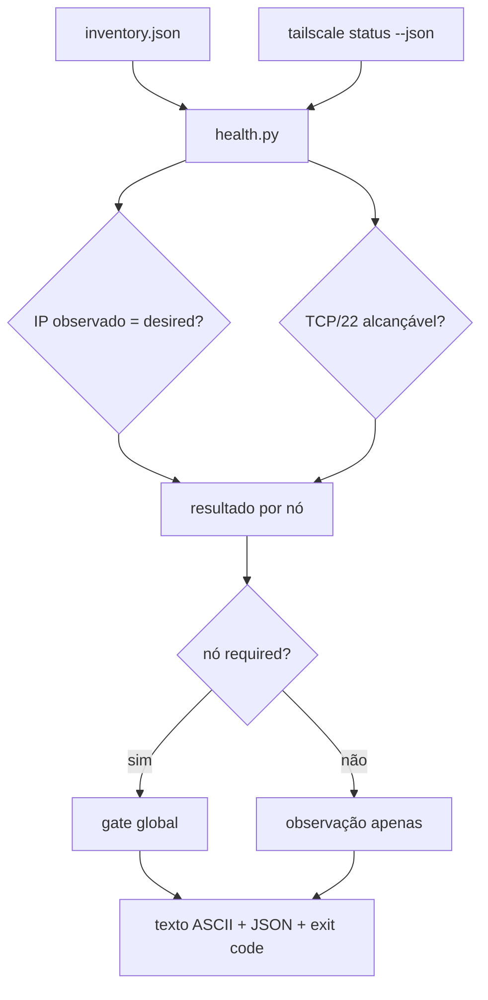

# UML — Management Network

```mermaid
flowchart LR
    X[x99\nworkstation\n100.101.23.111]
    P[pentium\nhomelab.control\n100.107.230.78]
    C[core\nhomelab.compute\n100.97.105.116]
    T[(Tailscale tailnet)]

    X --- T
    P --- T
    C --- T

    P -->|SSH allowlisted| C
    X -.->|desenvolvimento / diagnóstico| P
    X -.->|desenvolvimento / diagnóstico| C
```

## Health contract

```mermaid
flowchart TD
    I[inventory.json] --> H[health.py]
    TS[tailscale status --json] --> H
    H --> IP{IP observado = desired?}
    H --> SSH{TCP/22 alcançável?}
    IP --> R[resultado por nó]
    SSH --> R
    R --> G{nó required?}
    G -->|sim| S[gate global]
    G -->|não| O[observação apenas]
    S --> J[texto ASCII + JSON + exit code]
    O --> J
```

`pentium` e `core` participam do gate global. `x99` é opcional e não pode se tornar dependência operacional do homelab.
