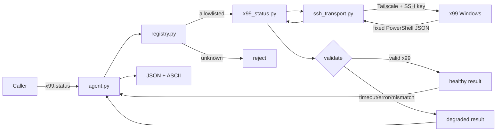
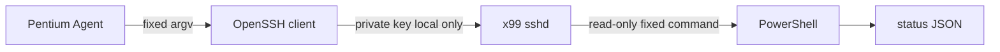

# UML — Pentium Agent / x99.status

```mermaid
flowchart LR
    U[Caller] -->|x99.status| A[agent.py]
    A --> R[registry.py]
    R -->|allowlisted| X[x99_status.py]
    R -->|unknown| E[reject]
    X --> T[ssh_transport.py]
    T -->|Tailscale + SSH key| W[x99 Windows]
    W -->|fixed PowerShell JSON| T
    T --> X
    X --> V{validate}
    V -->|valid x99| H[healthy result]
    V -->|timeout/error/mismatch| D[degraded result]
    H --> A
    D --> A
    A --> O[JSON + ASCII]
```

## Trust boundary

```mermaid
flowchart LR
    P[Pentium Agent] -->|fixed argv| S[OpenSSH client]
    S -->|private key local only| X[x99 sshd]
    X -->|read-only fixed command| PS[PowerShell]
    PS --> J[status JSON]
```

O chamador escolhe somente o nome nominal da ação. Ele não fornece shell, PowerShell, host, usuário, caminho de chave ou argumentos SSH.
