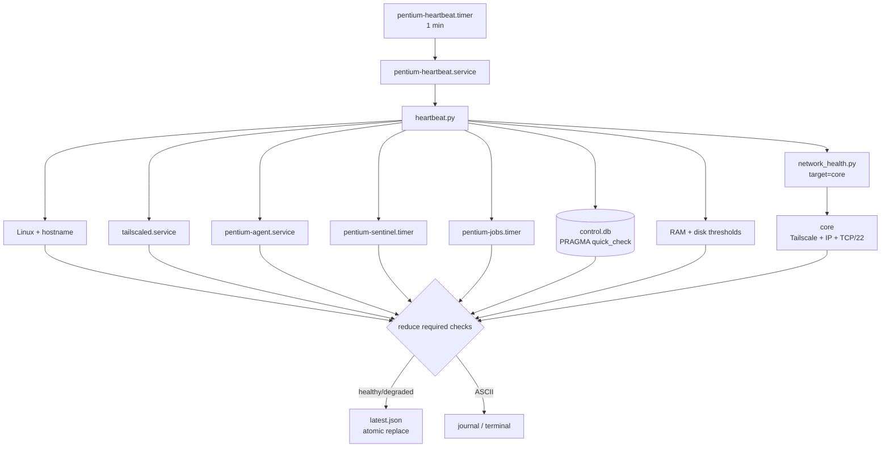
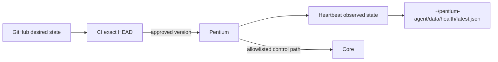

# UML — Pentium Control-Plane Heartbeat

```mermaid
flowchart TD
    T[pentium-heartbeat.timer\n1 min] --> S[pentium-heartbeat.service]
    S --> H[heartbeat.py]

    H --> OS[Linux + hostname]
    H --> TS[tailscaled.service]
    H --> A[pentium-agent.service]
    H --> SE[pentium-sentinel.timer]
    H --> J[pentium-jobs.timer]
    H --> DB[(control.db\nPRAGMA quick_check)]
    H --> R[RAM + disk thresholds]
    H --> N[network_health.py\ntarget=core]

    N --> C[core\nTailscale + IP + TCP/22]

    OS --> G{reduce required checks}
    TS --> G
    A --> G
    SE --> G
    J --> G
    DB --> G
    R --> G
    C --> G

    G -->|healthy/degraded| JS[latest.json\natomic replace]
    G -->|ASCII| LOG[journal / terminal]
```

## Ownership

```mermaid
flowchart LR
    GH[GitHub desired state] --> CI[CI exact HEAD]
    CI -->|approved version| P[Pentium]
    P --> HB[Heartbeat observed state]
    HB --> DATA[~/pentium-agent/data/health/latest.json]
    P -->|allowlisted control path| C[Core]
```

O heartbeat observa e evidencia. Ele não corrige automaticamente serviços, rede, banco ou Core nesta slice.
